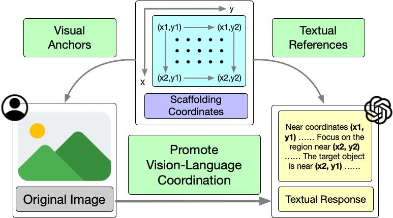
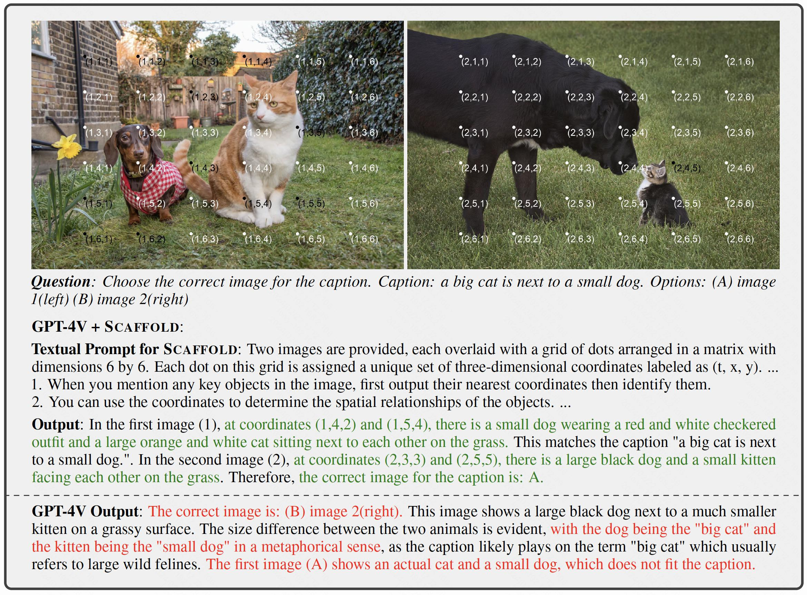
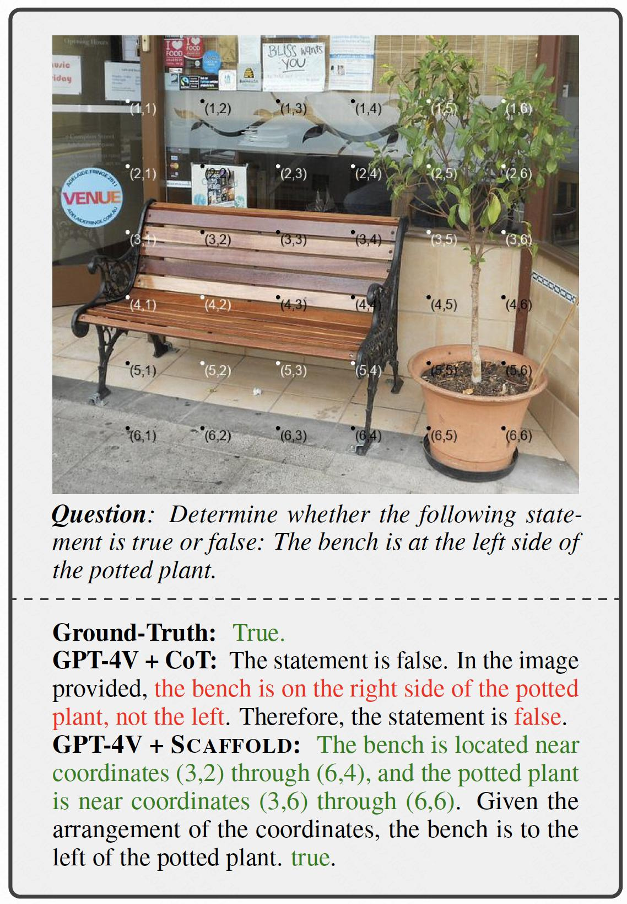
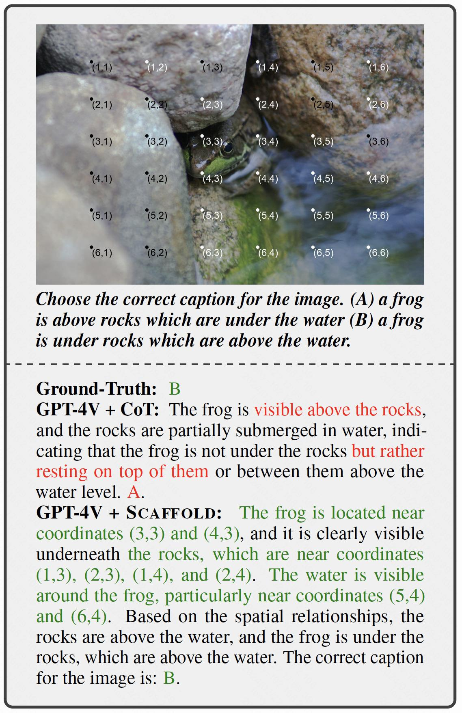
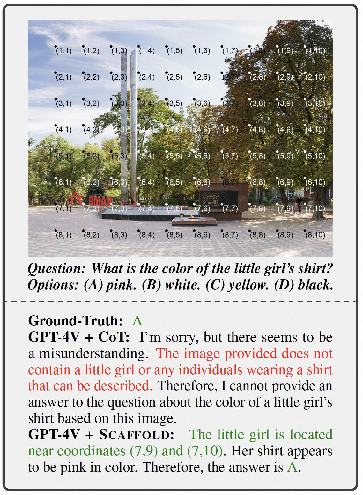
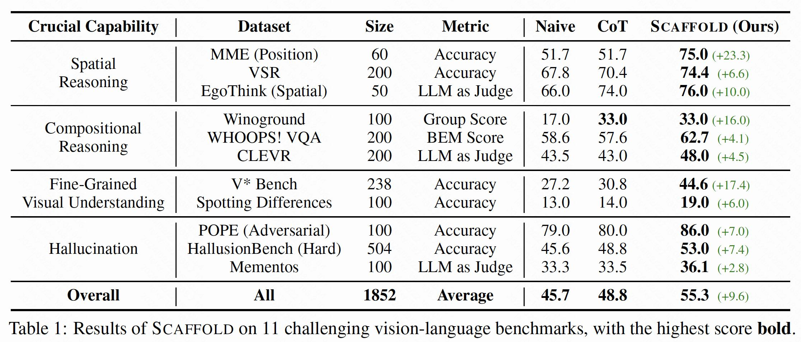
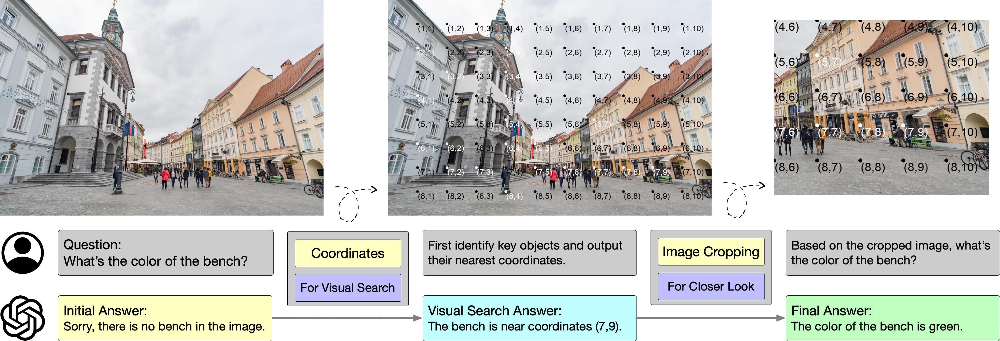
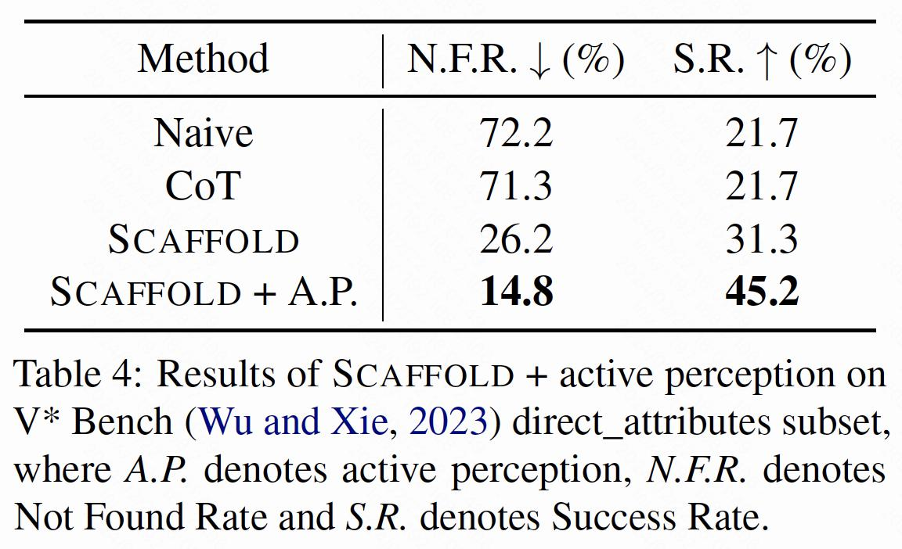

# Scaffolding Coordinates to Promote Vision-Language Coordination in Large Multi-Modal Models

This repository contains information, data and code of our paper: Scaffolding Coordinates to Promote Vision-Language Coordination in Large Multi-Modal Models.


<div align="center">

 | [日本語](docs/README_JP.md) | [English](README.md) |

</div>

## 🔥 Updates

[2024.02.22] We released the code to apply standard Scaffold prompting to vision-language tasks.

## 📍 Introduction

State-of-the-art Large Multi-Modal Models (LMMs) have demonstrated exceptional capabilities in vision-language tasks. Despite their advanced functionalities, the performances of LMMs are still limited in challenging scenarios that require complex reasoning with multiple levels of visual information. Existing prompting techniques for LMMs focus on either improving textual reasoning or leveraging tools for image preprocessing, lacking a simple and general visual prompting scheme to promote vision-language coordination in LMMs. In this work, we propose Scaffold prompting that scaffolds coordinates to promote vision-language coordination. Specifically, Scaffold overlays a dot matrix within the image as visual information anchors and leverages multi-dimensional coordinates as textual positional references. Extensive experiments on a wide range of challenging vision-language tasks demonstrate the superiority of Scaffold over GPT-4V with the textual CoT prompting.



The overall framework of Scaffold is shown in the above image, illustrating its overall approach to promote vision-language coordination.

For a full description of Scaffold, please refer to the paper: [Scaffold](https://arxiv.org/abs/2402.12058)


---

## 📦 Quick Start

Here is a quick guide to apply Scaffold prompting to vision-language tasks on top of GPT-4V. The example questions and ground-truths are placed in `data/examples/example.jsonl` , with the corrsponding images in `data/examples/imgs`.

**Step 0** Preparation.

You need to install required modules by running

```bash
pip install -r requirements.txt
```

If you want to apply Scaffold prompting to your own data, you need to organize your data into the format of the examples in `data/examples/example.jsonl`. The example of a valid sample is as follows.

```python
{
  "question_id": 1, 
  "image_path": "data/examples/imgs/1.jpg", 
  "question": "Determine the following statement is true or false: The person is facing the banana.", 
  "answer": 1
}
```

And you should put your image in the path specified in the `image_path`.

**Step 1** Process the images.

You can overlay the dot matrix and the coordinates on the original images by running

```bash
python image_processor.py
```

NOTE: We adopt our default setting of hyperparameters in our implementation, for instance, the size of the dot matrix is set to $6 \times 6$. If you want to customize the hyperparameters or further explore new methods, check and modify `image_processor.py`.

**Step 2** Call GPT-4V API.

Firstly, you need to fill in your own OpenAI API key at the `API_KEY` location (marked with TODO) in `call-api.py`. Then, you can run the examples by running

```bash
python call-api.py \
	--data-file data/examples/example.jsonl \
	--mode scaffold \
	--parallel 1
```

Finally, the results will be stored in the `log` directory.

---

## ⚙️ Method



The Scaffold prompting is designed for enhancing vision-language coordination in LMMs. The methods contains both the image overlays and the textual guidelines. Therefore, we will introduce the implementation of the method in visual and textual perspetives.

**Visually**, we enhance each input image with a uniformly distributed rectangular dot matrix, where each dot is labeled with multi-dimensional Cartesian coordinates. These dots serve as visual positional anchors, while their coordinates are utilized as textual references in textual responses. 

**Textually,**  we prepend textual guidance to task instructions for LMMs. This includes a brief description of the dot matrices and coordinates, accompanied by several general guidelines for their effective use. 


---

## 🚀 Use Cases

Here are some cases from our experiments.

1. Enhanced Spatial Reasoning Capability.

   <div align=center>
   
   </div>

2. Improved Compositional Reasoning Capability.

   <div align=center>
   
   </div>

3. Elicited Visual Search Capability on high-resolution images.

   <div align=center>
   
   </div>

---

## 📂 Results

We conduct extensive experiments on 11 challenging vision-language benchmarks on top of GPT-4V and the results are as follows.





Furthermore, we combine Scaffold with active perception and conduct experiments on V* Bench direct_attributes subset. The results, detailed as follows, indicate that Scaffold can function as an effective scaffold for active perception.

<div align=center>

</div>

## 👏 Citation

```
@misc{lei2024scaffolding,
      title={Scaffolding Coordinates to Promote Vision-Language Coordination in Large Multi-Modal Models}, 
      author={Xuanyu Lei and Zonghan Yang and Xinrui Chen and Peng Li and Yang Liu},
      year={2024},
      eprint={2402.12058},
      archivePrefix={arXiv},
      primaryClass={cs.CV}
}
```
